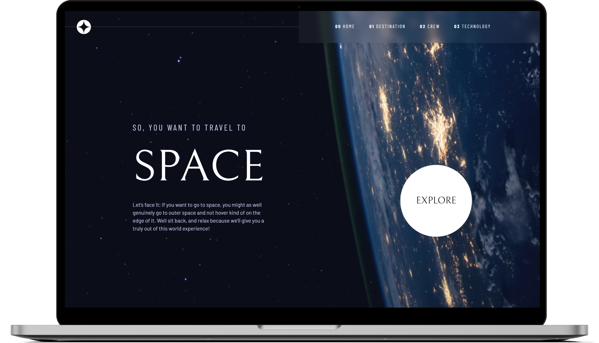
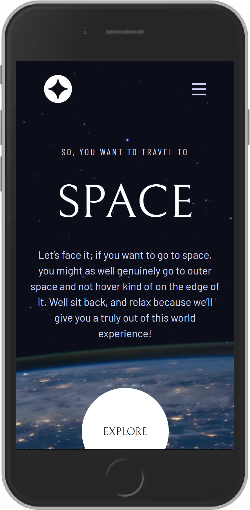

<h1 align="center">
  </img>
</h1>

<p align="center">
  <a href="#ℹ-descrição">Descrição</a> •
  <a href="#-tecnologias">Tecnologias</a> •
  <a href="#-pré-requisitos">Pré-requisitos</a> •
  <a href="#-como-usar">Como usar</a> •
  <a href="#-demonstração">Demonstração</a>
</p>

<p align="center">
  </img>
</p>

<p align="center">
  
  
  
</p>

## ℹ Descrição

Projeto desenvolvido como [desafio do Frontend Mentor](https://www.frontendmentor.io/challenges/space-tourism-multipage-website-gRWj1URZ3). 🚀

O desafio consistia em desenvolver o front-end do website seguindo, o mais estritamente possível, o design do Figma.

## ⚒ Tecnologias

- [**Svelte**](https://svelte.dev/)
  - stores writable, readable e svelte/transitions.
- [**Typescript**](https://www.typescriptlang.org)
- [**TailwindCSS**](https://tailwindcss.com/)

## ⚙ Pré-requisitos

- [Git](https://git-scm.com)
- [Yarn](https://yarnpkg.com)
- Editor de código.

## 🖥 Como usar

### Baixe o projeto e acesse a pasta

```cmd
git clone https://github.com/EduardoReisUX/space-tourism.git
cd space-tourism
```

### Instale as dependências e inicie aplicação na sua máquina

```cmd
yarn
yarn dev
```

## 👀 Demonstração

<p align="center">
  </img>
  </img>
</p>

---

<p align="center">Feito com 💜 por <a href="https://github.com/EduardoReisUX">Eduardo dos Reis</a></p>
